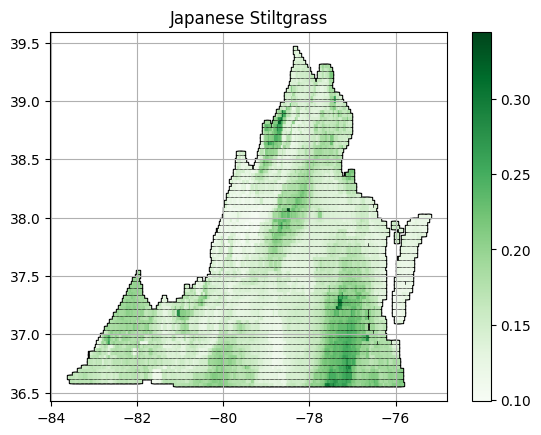

Disclaimer: This project originated from an end of year project in my college machine learning class. We were tasked with using the machine learning techniques we had been taught to solve a local problem. The results our group came to are detailed below, however, all of the code and graphics discussed or shown in this post were created by myself.  

## The Problem

One of Virginia's most incredible treasures is the unique connection it has formed with wild forests and mountains through numerous public parks and trail systems. Threatening this natural splendor, however, is the increasing rise of invasive species. Every year these destructive plants and animals can cost Virginia over one billion dollars by devastating crops, harming forests, and even poisoning livestock (more info [here](https://www.dcr.virginia.gov/insights/how-invasive-species-have-reshaped-virginias-land)). By modeling the growth of particularly widespread and destructive invasive species - such as Autumn Olive, Japanese Stiltgrass, and  Heavens's Tree - we hope we can better understand and manage these threats. 

## The Solution?

How do we go about doing this? One way is to train a machine learning model that can identify wether a particular point in a region has favorable conditions for the given invasive species. This is, in essence, a classification problem - specifically, a binary classification task. These models are typically called Species Distribution Models or SDMs and the "probabilities" they produce can be seen more as habitat suitability scores. 
  

Traditionally, SDMs are trained off of presence-absence data sets that contain points across a region that either do or do not contain a sample of the species. This kind of data needs to be collected through extensive field studies where scientists check not only for the presence of a species at specific locations, but if there are no samples in the given area as well. This kind of data is much more difficult to find, is more sparse in the forms it can be found in, and is generally unavailable for certain regions and plant varieties. Luckily, [iNaturalist](https://www.inaturalist.org) provides crowd-sourced presence-only data. iNaturalist provides users the ability to leverage powerful computer vision tools to classify plants and animals they observe through a smartphone app and then submit these observations to a central database (self described as “an online social network of people sharing biodiversity information to help each other learn about nature”). Research grade observations are a specific type of classifications that the community has determined are accurate and can be used for scientific analysis - perfect! 

After downloading the respective observations we also collected a larger file of all research observations across Virginia. For each of the three plants we hoped to study, we sampled a number of observations proportional to the number of observations we had for the species randomly from the larger dataset that were not of the same species. This way, for each species we had a set of points containing known observations of the plant and a set of points that did not contain the species. 

The remaining issue is that of spatial bias. Due to the nature of how observations are collected on iNaturalist, observations are likely to come from parks, trails, and other locations highly correlated with human activity and interest. To combat this, we fitted our model on environmental data collected about locations and not locations themselves. Using [pyimpute](https://github.com/perrygeo/pyimpute) and [latlon_utils](https://github.com/Chilipp/latlon-utils), we gathered environmental variables such as Annual Mean Temperature, Isothermality, Annual Precipitation, and elevation from [WorldClim](https://www.worldclim.org/) for each observed location. WorldClim is a free resource for global climate data that allows our models to learn what environmental and bioclimatic variables fit each species. We can now generalize our results to the whole of Virginia, yay!

After testing numerous models and techniques using 5 fold cross validation, we settled on a soft voting classifier (the "soft" aspect is key as it allows us to retrieve probabilities for our predictions rather than a binary classification of 0 or 1) that used six models: Support Vector Classifier, RandomForest Classifier, kNearestNeighbor, AdaBoost Classifier, XGBClassifier, and a LogisticRegression classifier. The model architecture is depicted below.

Many machine learning models suffer a lack of interpretability (our ability to understand why they reach a particular result) in how they make their predictions. This can reduce our confidence in their ability to find meaningful, generalizable patterns in data. While it isn't easily possible to interpret all of the models we used (such as XGBClassifier), we can further analyze our random forest model (which preformed fairly well on its own) since it is a type of decision tree (which are some of the most interpretable kinds of models). To do this, we can rank the mean decrease in impurity (a metric for how class mixed the dataset is before and after a decision split) for each feature across all of the trees in our random forest. The particular example shown below is from a random forest classifier trained on our Autumn Olive dataset.

From this result, we can see some of the most important environmental variables are temperature and water vapor related.

## Results

We decided on using F-1 scores to evaluate each model on their respective test set (twenty percent of the original
dataset) as they allowed us to combine precision and recall into a single comprehensive metric. Our final voting models
achieved a weighted F-1 score of 0.713 for the Autumn Olive model, 0.691 the Japanese Stiltgrass model, and 0.730
for the Tree of Heaven model. We attribute some of the difficulty in creating accurate models to the nature of our
random sampling method which samples any species not of the same type, even species that might have similar growth
conditions and preferences to the relevant invasive species of study (which in turn would make differentiating those
points difficult for the models).

While we can query particular points in Virginia and determine if the conditions at that point are favorable for a particular invasive species, a more useful result may be a state wide made. To create this, we start with a grid of equally distributed points across Virginia and use the same data collection algorithm from our training step to gather environmental information about each point. We then took the predicted probabilities from our model and graphed them with darker color tones representing a higher numerical value. These are layered on top of a gray background for Virginia to aid in visibility and are shown below. 

  

Smaller, more targeted maps for specific state parks could be made using our model by adjusting the scale and longitude, latitude bounds of the collected points. 

We hope that our project offers an interesting solution to modeling the growth and environment of invasive species in Virginia. At the core of our project was the idea that we should be able to empower local communities even if they are understaffed and underfunded. Extensive land surveys and field studies can be expensive and infeasible in more remote regions of the US. But iNaturalist, ClimData, and other sources offer invaluable information publicly for free which can allow for the creation of powerful tools in the study and prevention of invasive species allowing anyone with access to a smart phone the ability to contribute to the cause.  

## Useful References

Below are a couple of useful resources I found incredibly helpful during this project. 

[Deep Learning Methodology for Early Detection and Outbreak Prediction of Invasive Species Growth](https://openaccess.thecvf.com/content/WACV2023/papers/Elias_Deep_Learning_Methodology_for_Early_Detection_and_Outbreak_Prediction_of_WACV_2023_paper.pdf)

[Species Distribution Modeling for Machine Learning Practitioners: A Review](https://dl.acm.org/doi/fullHtml/10.1145/3460112.3471966)

[A brief introduction to Species Distribution Models in Python](https://daniel-furman.github.io/Python-species-distribution-modeling/)