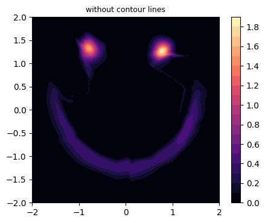
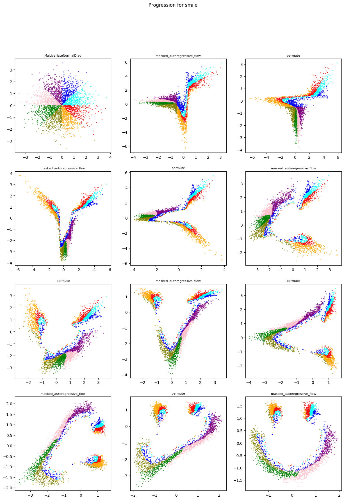

_Disclaimer: This project idea originated from an end of year project in my college probabilistic machine learning class.All of the code and graphics discussed or shown in this post, however, were created by myself._  

Let's consider a hypothetical situation. We have data drawn from a complicated distribution. We would like to develop a model to represent this distribution so we can calculate density estimates from a set sample of points. We have heaps of good techniques for modeling and sampling from simple probability distributions (say a standard Gaussian), but no clear path to representing this more complicated, unorthodox distribution. What if we could train a machine learning model to transform data from a known, easy distribution (like our Gaussian) into a point in our target distribution? This is exactly Masked Autoregressive Flow or MAF allows us to do!

Let's see this in action by creating a toy dataset and then training a MAF model to represent the underline distribution. Our dataset can be seen below (this was created using a combination of Scikit-learn's make moons and make circles toy dataset tools).

Our goal is to chain together a series of bijectors in a flow that slowly progress a point gathered from a standard gaussian (also called our base distribution) to one in our target distribution. This way we can generate new samples in our target distribution by sampling from our base distribution. A bijector is an invertible mapping from one probability space. This means we can also take a point from our target distribution and send it backwards through our model and receive a point in our base distribution which we can then find a probability for. 

Luckily for us, TensorFlow has an extensive probability library which contains, amongst other things, various implementations for bijectors which can be combined in a chain to form a flow and then subsequently trained. 

The specific bijector we would like to use is MADE or Masked Autoregressive Density Estimation. Lets break it down word by word. Masked here means we create a specific neural network mask (i.e a matrix to block certain connections between nodes in the network) so that for each input node, it is only effected by the nodes "above" it. Autoregressive means that each node represents a probability conditioned on all previous "above" nodes / inputs. This means our output layer outputs a series of conditional probabilities for each feature that can be combined into a final probability for the data point. This methodology is then used to create a density estimation model. Thus, MADE. To prevent favoritism with the autoregressive property, we permute the features each time so that the ordering of our conditional probabilities will change with each layer of the flow (this will be seen visually later).

<!-- 
For a stronger understanding of this, lets consider an example where we have three input nodes x1, x2, and x3 (in our toy example we would only have two since we are working with a 2d dataset).
-->

For this dataset, I chained together 6 of these MADE bijectors and got the following contour plot. 

Success....sort of. While it is faint, we can see these strange connective strands between the eyes and the smile. These artifacts are called "density filaments", and they are a result of the architectural limitation that transformations must be invertible. Invertibility means the resulting transformed distribution will topologically have the same support as the base distribution. The consequence of this is that since we are using the standard Gaussian as our base distribution and because the standard Gaussian topologically has a support that has a sole (unimodal) continuous component, the resulting transformed distribution also has a unimodal support. Thus can not perfectly model a distribution with a support composed of disconnected segments (such as the eyes of the smiley face where points between the two eyes have zero probability). Still, our model looks remarkably similar to what we might imagine the target to be like. 

One final interesting plot we can generate to get a better intuition for how flow models work is shown below. 

To generate this plot, we begin by taking a large sample from our base distribution. Next, we push the sample through one bijector at a time and plot at each step. Additionally, I uniquely colored each octant for additional readability. This way, we can visually see how each step transforms our base distribution closer and closer towards our target. In-between each autoregressive layer, we can see our permutation flipping the order of features (in the 2d case this simply tilts the image by ninety degrees).

In a future blog post, I hope to explore further how such custom architectures are implemented in Tensorflow and similar libraries.

## Useful References

[MADE](https://arxiv.org/pdf/1502.03509)

[MAF](https://arxiv.org/pdf/1705.07057)

[https://blog.evjang.com/2018/01/nf1.html](https://blog.evjang.com/2018/01/nf1.html)