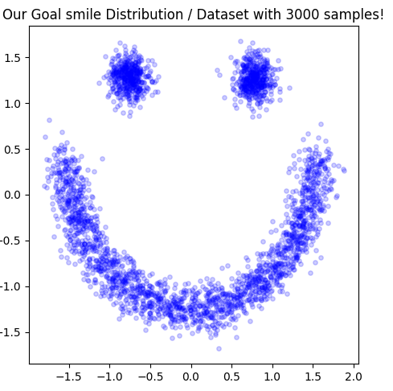

# Warning, this page is under construction. Read at your own risk!

_Disclaimer: This project idea originated from an end of year project in my college probabilistic machine learning class.All of the code and graphics discussed or shown in this post, however, were created by myself._  

Let's consider a hypothetical situation. We have data drawn from a complicated distribution. We would like to develop a model to represent this distribution so we can calculate density estimates from a set sample of points. We have heaps of good techniques for modeling and sampling from simple probability distributions (say a standard gaussian). What if we could train a machine learning model to transform data from a known, easy distribution into a point in our target distribution? This is exactly Masked Autoregressive Flow allows us to do!

