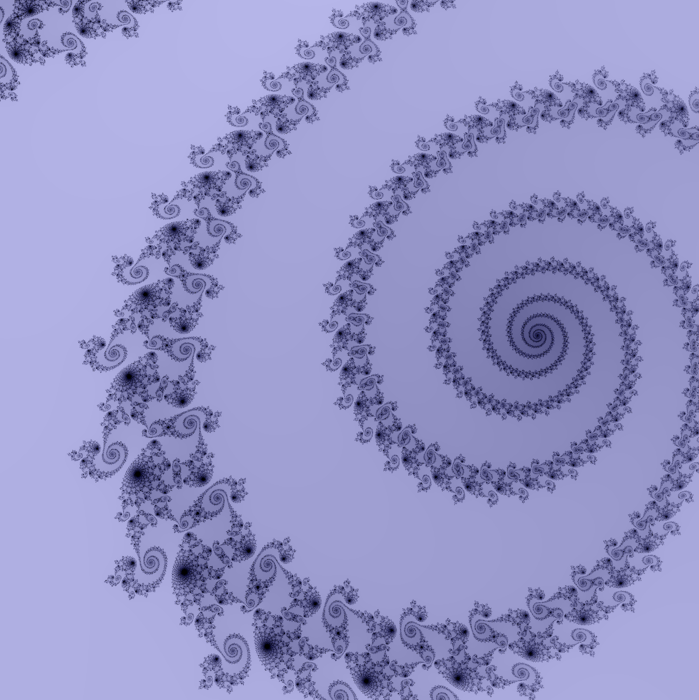

<style>
.round {
    border-radius: 50%;
}

.box{
    display: flex;  
    align-items: center;  
}
.boring{
    width: 50%;
    background: black;
    height:5px;
}


</style>


The Mandelbrot set is one of the most famous and commonly discussed fractals - it is almost impossible to escape on the internet. My first encounter with the set was in highschool where some friends and I explored it after a particularly fun calculus lecture. I only recently realized, however, that I never truly understand how these gorgeous images were generated and what semantic meanings the vibrant colors held. Let's fix that by coding up our own simple Mandelbrot displaying program!

First, we should understand what the mandelbrot set is. Consider the very simple quadratic polynomial shown below.

$f(x) = x^2+c$

If we pick some value for c such as 3 and say we start x as 0, then we can plug our values into $f(x)$ and get $f(x) = 0^2 + 3 = 3$. Exciting stuff! More interestingly, what if we say instead of $x$ being 0, it is the previous value of $f(x)$ i.e 3. We would get $f(f(0)) = f(3) = 3^2 + 3 = 12$. This is called "iterating" a function and we can see if we continued to do this for $c = 3$ we would get a rapidly increasing value. When this value continues to grow off into infinity, we call that value as escaping. 

If we consider another example (starting at x=0 again), say $c = -1$ we get the following.

* $f(0) = 0^2 + -1 = -1$
* $f(-1) = (-1)^2 + -1 = 1 - 1 = 0$
* $f(0) = 0^2 + -1 = -1$
* ...   

In this case, the value will always oscillate between -1 and 0, thus never exploding off into infinity. It has not escaped. 

On the real number line, we find that the interval -2 to 1/4 contains all non-escaping points. This makes for a pretty boring image

<div class="box">
-2   <div class="boring"></div>   1/4
</div>


^ there it is, super boring 

We can get much more interesting and complex (ba dum tss) results by moving to the complex plane. A complex number is a number $a + b \cdot i$ with two components, a real component $a$ and an imaginary component $b$ defined such that $i \cdot i = i^2 =  -1$. Using this one property, we can define complex multiplication as $(a_1+b_1i) \cdot (a_2 + b_2i) = a_1 \cdot a_2 + a_1 \cdot b_2 i + b_1i \cdot a_2 + b_1i \cot b_2i = (a_1 \cdot a_2 - b_1 \cdot b_2) + (a_1 \cdot b_2 + b_1 \cdot a_2)i$. Much like a number line can be used to represent the "complete" range of real numbers, we can use a complex plain to represent the gambit of complex numbers where x is traditionally the real component and y is the complex component. Side note, imaginary numbers have lots of interesting meanings, including in representing rotations (for example, multiplying a complex number by i rotates it 90 degrees).

In either case, we can now take a plane of complex values, and for each point (which corresponds to a pixel in our image) we can check wether that point escapes or fails to escape after a certain number of iterations (this method is called naive escape and is only an approximation, higher iteration counts yield better and better results). We color each point according to how long it took to escape a set boundary (we usually check wether our point is more than a distance of two away from the center of the plane since the set is bounded by 2). My program uses a simple linear gradient (for a given step size, we take one rgb point and linearly step towards a second rgb color) but more advanced coloring methods exist.

This process can be computationally expensive. For this reason, it is advantageous to multi-thread or vectorize the code so that we don't have to loop over every pixel and individually check it. Below is a small code snippet that shows how I choose to do this. 


````
for i in tqdm.tqdm(range(max_iter), disable = not verbose):
        z = np.where(done == 1, np.square(z) + c, 0)  
        done = np.where((done == 0) |  (np.absolute(z) > 2), 0, 1)
        map = map + done 
````

* tqdm is just a nice way to have a progress bar in python
* the for loop is over the maximum number of iterations that we check
* for each iteration, we take every pixel that is not done (which for later convience is represented as a 1 in the done matrix) and iterate it through the polynomial 
* Then, we check if we have gone over
* Rinse and repeat

With such a simple principal, we are able to discover an incredible world of infinite complexity! Below I show just a few interesting images I took using my program. 

### Elephant Valley 


### Smaller Copies of the Mandelbrot Set


### A Fun Staircase Spiral


A similar, related idea is found in Julia sets which instead set c as a set complex number and use the points on the complex plain as the starting x value when iterating over our polynomial.


My code is available for viewing and download via the github repository found [here](https://github.com/AlexSosnkowski/mandelbrot).

## Useful References

