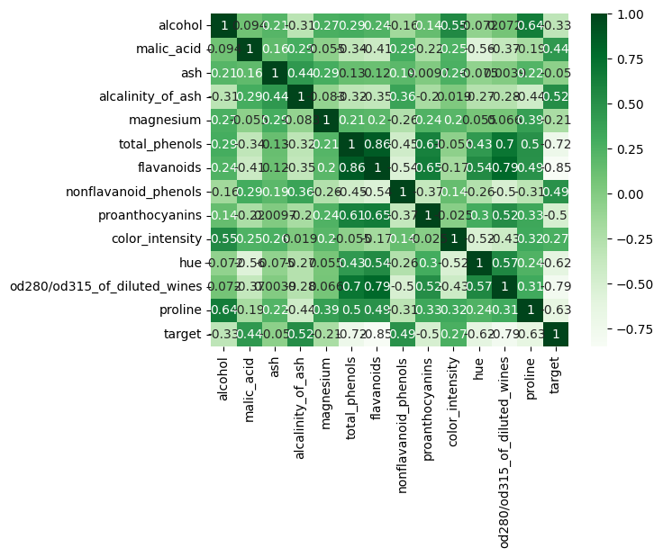
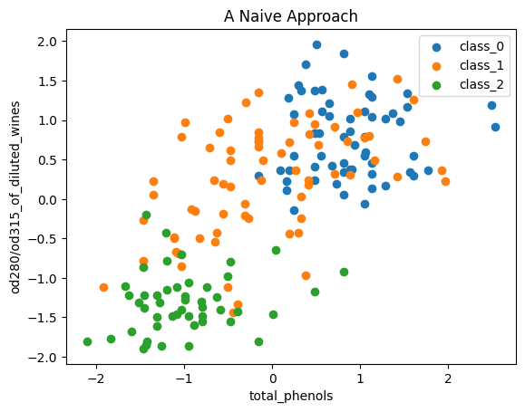
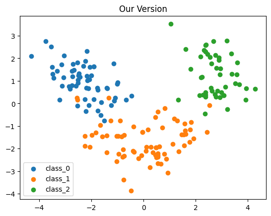
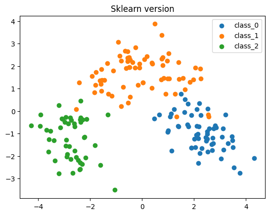
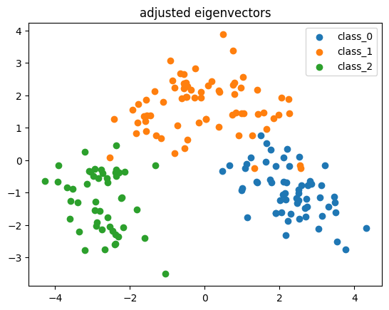
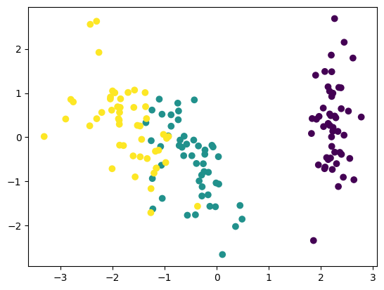
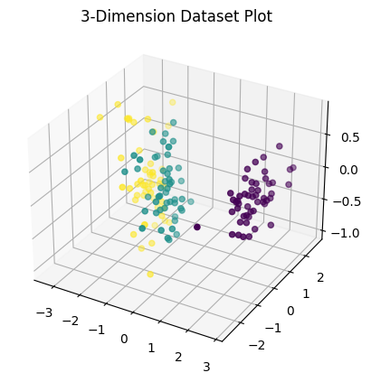

#Warning this article is a work in progress! Read at your own risk!

A while back I was reading an interesting paper ([this](https://arxiv.org/pdf/2310.06824) one), and its usage of Principle Component Analysis or PCA intrigued me. It was the first time I have ever heard of the technique, so I went about learning more the only way I know how - by searching the web! 

I found quite a few excellent blogs (linked at the bottom), however, I wasn't able to find any writeups that showed a coded implementation of PCA that wasn't reliant on a library implementation like Scikit-learn's version of PCA. After researching the mathematical foundation / theory behind PCA, I realized it is incredibly simple and straightforward to implement. Lets jump in!

## The Goal

Humans have gotten incredibly good at representing two, three, or even four dimensional datasets with traditional graphing techniques. The problem is that many real world datasets can have tens if not hundreds of features. This curse of dimensionality can be especially annoying when we are trying to understand and gain intuition about the data itself as we have no straightforward way of visualizing it without simply dropping dimensions. But what if there was a way we could squish down a high dimensionality dataset to a few key features (say two or three) that are easy to plot? This is exactly what PCA lets us do!

## A Brief Review of Covariance Matrices and Eigenvalues / Eigenvectors

## Working with Real Data

One of the oldest metrics to observe the relationship between features in a dataset is correlation. The correlation between two features is effectively a normalized covariance.

Our goal is to generate two or three new features that are a linear combination of all other features such that our new features pack as much information as possible. Thus, we do not want our new features to be correlated with each other as this would be wasted "information" i.e more compression is potentially possible.

An initial idea may be to simply select the most correlated features with our target value. There are numerous problems with this idea, but for fun lets try it on a real dataset! 

I will begin by using the sklearn wine toy dataset that asks us to classify between 3 different wine cultivators in Italy using 13 chemical features. 

A quick look at the corelation between features in the dataset is shown below.

It looks like total_phenols and od280/od315_of_diluted_wines are the strongest correlated features with our target so lets plot those two features on their own to see if our data has a clear separation! 

It's certainly not terrible but it still leaves much too be desired as the classes mix in difficult to linearly separate ways. 

What we need is a more advanced, informed technique. In comes PCA.

To do this, we take our covariance matrix for our dataset and find its Eigen values and Eigen vectors. There are two key features of a covariance matrix that ensure this is possible. A covariance matrix is symmetric and positive semi-definite. This ensures we have non-negative Eigen values. 

These Eigen values represent how for the direction (the direction dictated by the Eigen vector associated with said Eigen value...enough Eigens?).

From there, it is a simple process of projecting our data onto the top (highest Eigen value) Eigen vectors for however many dimensions we want in our final transformed dataset.  

For the wine dataset, we get the results below. 

Lets compare this to the results we get using Scikit-learn.

Uhhhhhh.... why is it flipped? That can't be good right? Actually, I believe this is a fairly simple issue! For my implementation, I used Numpy to get our Eigen values and Eigen vectors (how these are numerically approximated merits its own blog). An Eigen vector can be multiplied by any non-zero scalar and still be a valid Eigen vector for the given Eigen value. To show this, consider the following for some matrix A, non-zero scalar $\alpha$, eigen vector v, and eigen value $\lambda$. 

$A(\alpha v) = \alpha (A v) = \alpha \lambda v = \lambda(\alpha v)$

So $(\alpha v)$ still matches our definition of an Eigen vector for eigen value $\lambda$.

After flipping our Eigen vectors (multiplying them by -1) we get the following result which matches Scikit-learn's implementation.

We can try other datasets as well, including the famous Iris dataset.

We can also do 3d plots for when we use 3 dimensions in our projection!

You can view and run my complete Jupyter Notebook on Google Colab [here](https://colab.research.google.com/drive/13g6LOxFrkEXbphEVFBCCMHi-HhrCz2aq?usp=sharing).

## Useful References

[https://builtin.com/data-science/step-step-explanation-principal-component-analysis](https://builtin.com/data-science/step-step-explanation-principal-component-analysis)

[https://www.realcode4you.com/post/principal-component-analysis-pca-using-wine-dataset-hire-data-science-expert](https://www.realcode4you.com/post/principal-component-analysis-pca-using-wine-dataset-hire-data-science-expert)