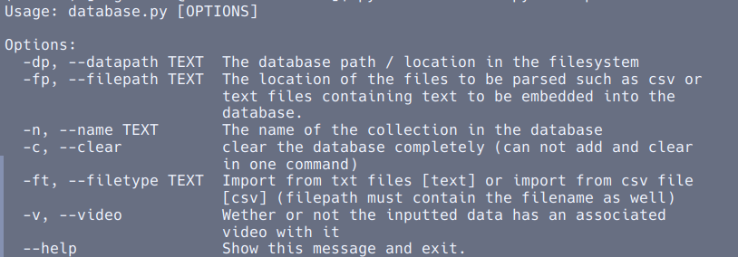
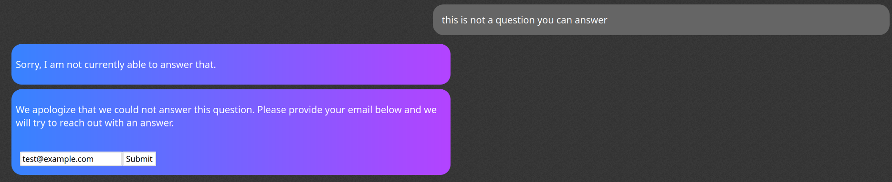

## The Setup

Over the past summer, I was tasked with creating an AI chatbot web app as part of an internship. Due to the more sensitive nature of the chat bots intended audience, ensuring responses remained accurate and sensitive was of the utmost importance. Furthermore, the specific topic the chat bot served as resource for was outside the standard training set for LLMs. Thus, I needed to employ a variety of techniques to achieve a knowledgeable and reliable agent. This post outlines a more general framework for creating a chat system with these considerations in mind. 

## The How

Have you ever wondered how LLM agents can comment on events and information only released after the initial training dataset was collected? One quick and easy technique is called Retrieval Augmented Generation or RAG.

In essence, we maintain some bank of information tidbits. For every user query, we grab some of the most relevant material from our store and pass it in as context to our LLM. This information bank can take any number of forms. Web or wiki searches, other more specifically trained large language models, or in this case a vector database. 

A vector database is similar to any SQL database (in fact, many are some form of SQL database on the backend) except that they contain high dimensional (usually thousands of dimensions) embeddings for the text they store. Text embeddings are a way of representing text as a large vector or list of numbers (usually obtained from a neural network). We can intuitively think of each dimension as encoding how far the text is on some "axis". A simple example might be a dimension that represents heat - so text surrounding something hot would have a large value in this dimension and vice versa. In reality, it is often not intuitive what exactly these dimensions represent, however, they capture a semantic understanding of the text in a mathematical structure that is capable of being concretely compared to other embeddings (using vector distance metrics).

For my system, I used ChromaDB with OpenAI's Ada002 embeddings and a cosine similarity metric. Text in the form of ideal question, answer pairs can be added to the vector database through a command line Python tool that accepts either a csv file format or directory of text files each storing a q&a pair.  

We can also attach metadata to entries of various data types. In our case, each entry can have an option video url attached so that users can receive not only a text-response, but an informative reference video relating to their question as well.

This system gives us the following program flow. A user sends a query to the chatbot. The query is transformed into a text embedding that is then compared to every text embedding in the database. The most similar question and answer pair from our database can then be passed along as context to the LLM, and its response returned to the user. 

But what about user questions that don't have a close match, we wouldn't want to give the wrong context to the LLM as this could produce nonsensical results? For this reason, there is a similarly threshold that must be met in order for the user to receive a response. otherwise, an automated data collection system is initiated that allows the user to enter their email and receive a human response in the near future. My specific implementation can both add unanswered questions to a Google Sheet, or send them as notifications in a slack channel. 

## Fine Tunning

RAG is an excellent tool for giving LLMs the context information they need to answer questions for which said context is either not publicly available, was not included in the initial training set, or is generated on the fly. If there is a specific format you would like LLM responses to take, however, another technique is required. Prompt engineering offers a quick and cheap option - the chatbot is simply given a prompt at the beginning of each conversation outlining how it should reply. A more substantial option is found in fine tunning - a process in which a new, small dataset is provided so that key layers of the LLM can be re-trained on it. Though fine tunning generally fails to retain specific information, it can successfully alter the form and manner of the LLM's responses as noted by OpenAI [here](https://platform.openai.com/docs/guides/fine-tuning/when-to-use-fine-tuning). 

## Video Demo
<iframe src="https://youtube.com/embed/CecMuqo3Hy4" frameborder="0" allowfullscreen></iframe>​

## Going Further

Having a web app that can be hosted locally is great for initial development, however, at some point it needs to be made available via the internet. I found that one of the quickest ways for small to medium size projects is to set up a Digital Ocean's droplet and run critical processes (like NodeJS) with nohup (a command that ensures the process remains running in the background even after your ssh session ends). Nginx can be setup to forward the port your app is running on to an internet accessible port.

Code for this project can be found on [here](https://github.com/AlexSosnkowski/chatbot).

## Useful References

